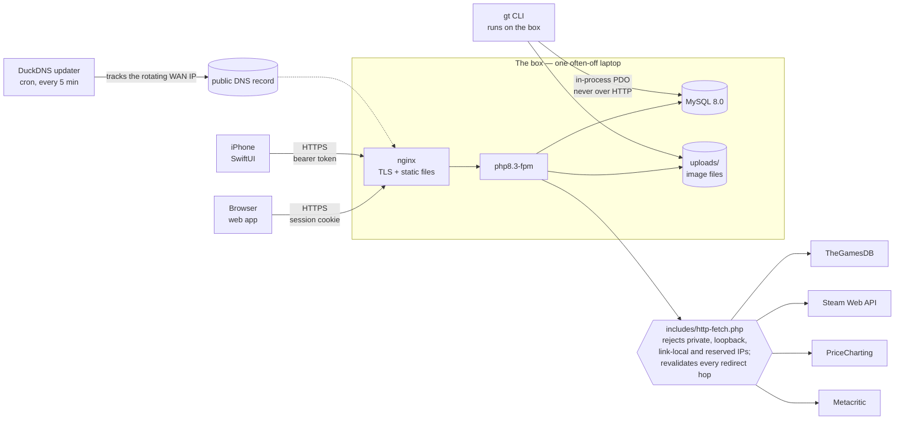
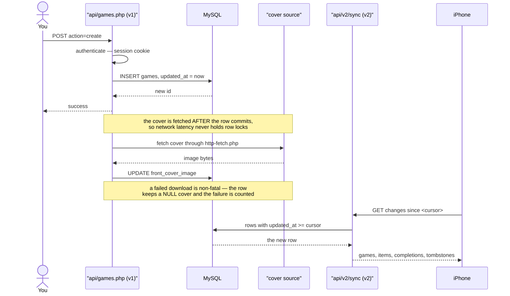

# Level 1 — The system from outside

## 1. System context

One intermittently-powered laptop serves three different consumers, and reaches
four external services through a single guarded exit.

Three things this diagram is trying to tell you:

- **The CLI is not a client.** `gt` talks to MySQL in-process through the same
  `includes/config.php` that gives the web app its `$pdo`. It never goes over
  HTTP, so it needs no auth token and is unaffected by nginx.
- **There is exactly one exit to the internet.** Every external fetch goes
  through `includes/http-fetch.php`. Calling `file_get_contents` or curl on a
  user-supplied URL anywhere else reopens the SSRF hole that
  `tests/v2/test_ssrf.sh` and `tests/v2/test_v2_cover_ssrf.sh` guard.
- **If the site resolves on the LAN but not by name, suspect DNS first.** The
  WAN IP rotates and a cron job chases it.

**Goes stale when:** a new external service is called, the box's stack changes,
or the SSRF guard stops being the single exit.

## 2. User journey

One game, from typing it in to it appearing on the phone. The least detailed
diagram here on purpose — it exists to make the other eight legible.

**Goes stale when:** the create path changes, or covers stop being fetched after
commit.
