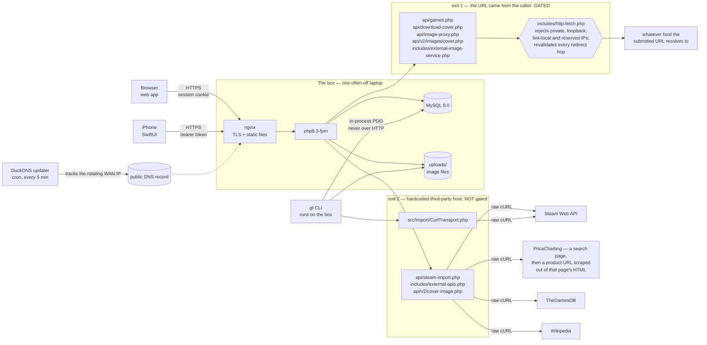
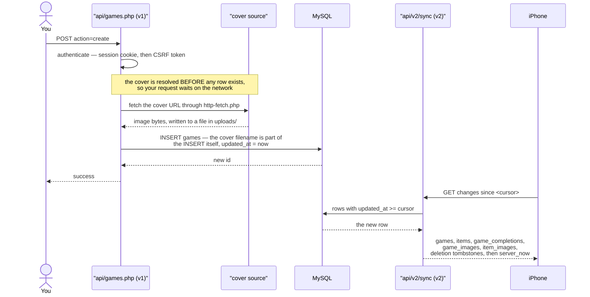

# Level 1 — The system from outside

## 1. System context

One intermittently-powered laptop serves three different consumers, and reaches
the internet by **two** different exits — only one of which is gated.

Four things this diagram is trying to tell you:

- **The CLI is not a client.** `gt` talks to MySQL in-process through the same
  `includes/config.php` that gives the web app its `$pdo`. It never goes over
  HTTP, so it needs no auth token and is unaffected by nginx.
- **The guard gates attacker-influenced URLs, not "all external traffic."** The
  distinction is *where the URL came from*, not whether the request leaves the
  box. A URL the caller supplied — a cover URL posted to a create, a proxied
  image, a requested cover — goes through `includes/http-fetch.php`. A request
  built around a host hardcoded in the source does not: `api/steam-import.php`,
  `includes/external-apis.php`, `api/v2/cover-image.php` and
  `src/Import/CurlTransport.php` each hand their URL straight to cURL, and the
  first two contain no call into the guard at all. `tests/v2/test_ssrf.sh` and
  `tests/v2/test_v2_cover_ssrf.sh` cover the gated exit only.
- **The ungated exit is not purely theoretical.** `includes/external-apis.php`
  scrapes PriceCharting's search page, pulls a product URL *out of the HTML that
  came back*, and fetches it with redirect-following enabled. The target of that
  second request is therefore influenced by remote content, and it passes through
  no guard. Note also that `includes/http-fetch.php`'s own docblock asserts every
  external fetch in the app goes through it — it does not, so do not treat that
  comment as a map.
- **If the site resolves on the LAN but not by name, suspect DNS first.** The
  WAN IP rotates and a cron job chases it.

Metacritic is **not** a dependency, despite the field. Auto-fetch was abandoned
after every free source broke or got paywalled; both `api/metacritic.php` and
`api/v2/metacritic.php` now return a fixed "no longer supported" response without
fetching anything, and scores are entered by hand.

**Goes stale when:** a new external service is called, the box's stack changes,
or a fetch moves between the gated and ungated exits in either direction.

## 2. User journey

One game, from typing it in to it appearing on the phone. The least detailed
diagram here on purpose — it exists to make the other eight legible.

**There are no transactions on this path at all.** `api/games.php` never begins
or commits one. So there are no row locks for a slow fetch to hold — but there is
also nothing to roll back, and the cost lands on the user instead: the response
does not go out until the cover has been resolved.

**What a failed cover does here.** A URL that will not fetch is left in the column
*as a URL* — the column legitimately holds URLs and this is pre-existing
behaviour — and nothing is counted. An undecodable `data:` URI is a hard 400 and
no row is created at all: storing the URI is the behaviour being removed, so it
fails loudly rather than falling back.

**Post-commit cover fetching is real, but it belongs to the CLI import path, not
this one.** `gt import` commits its transaction in `src/Services/Write/Importer.php`
and fetches covers afterwards, so there network latency genuinely never holds row
locks, a failed download is non-fatal, the row lands with a NULL cover, and the
failure is counted. None of that describes the web create path above — do not
carry the reassurance across.

**Goes stale when:** the v1 create path reorders its fetch and INSERT,
`api/games.php` gains a transaction, or the set of tables the delta sync streams
changes.
