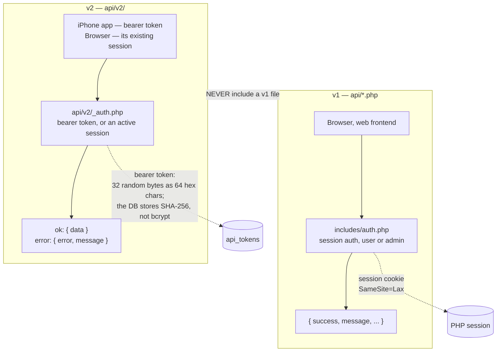
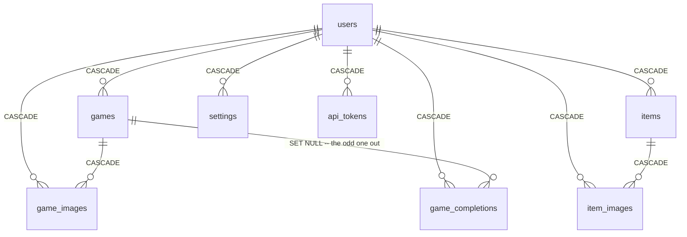

# Level 2 — The two generations

## 3. v1 vs v2

Two parallel API generations with different auth, different response shapes and
different include graphs. This is the single biggest source of confusion in the
codebase, which is why it gets a diagram rather than a paragraph.

| | v1 | v2 |
|---|---|---|
| Lives in | `api/*.php` | `api/v2/` |
| Serves | the web frontend | the iOS app, and the browser for some reads |
| Auth | session cookie | bearer token, *or* an active session |
| Success shape | `{ success: true, ... }` | `{ data: ... }` |
| Error shape | `{ success: false, message }` | `{ error: "slug", message }` |
| Mutations | must be POST — 405 otherwise | per-endpoint |

Things worth knowing that the boxes cannot show:

- **SHA-256 rather than bcrypt is deliberate**, not an oversight. A token is 32
  bytes of entropy already, so the hash only needs to be a cheap deterministic
  lookup key.
- **v2 never includes a v1 file.** An earlier design set `$_SESSION` and
  installed an output buffer to reshape v1 responses into v2 shape. That is gone;
  do not reintroduce it.
- **CSRF token enforcement on v1 is live, not pending.** The check runs on the
  mutating paths of nine endpoints — `api/games.php`, `api/items.php`,
  `api/settings.php`, `api/completions.php`, `api/admin.php`, `api/upload.php`,
  `api/steam-import.php`, `api/stats.php` and `api/import-gameeye.php` — reading
  the token from either the `X-CSRF-Token` header or a `csrf_token` form field,
  and answering a missing or invalid one with a 403 that ends the request before
  any state changes. POST-only mutation and `SameSite=Lax` sit on top of that as
  additional layers; they are not substitutes for it. The token primitives live in
  `includes/csrf-core.php`, which has no dependencies, so `/api/v2/` can include
  them without inheriting a v1 include chain; `includes/csrf.php` is the v1 surface
  over it.
- **The browser reaches v2 with its session, not a token.** `js/api.js` has a v2
  GET helper that sends the request same-origin so the cookie rides along, and the
  game form uses it. That is why the auth row above says "bearer token, *or* an
  active session" — the mermaid used to show the phone as v2's only consumer,
  which was wrong.
- The browser is deliberately never issued a bearer token: an HttpOnly session
  cookie cannot be read by injected JS, and any token the frontend could attach
  could also be stolen.

**Goes stale when:** auth or response shape changes on either generation, the set
of v1 endpoints enforcing CSRF changes, or the v1/v2 isolation rule is relaxed.

## 4. Data model

Twelve tables. The delete rules on the edges *are* the behaviour, so they are
drawn rather than described.

Standalone tables with no foreign keys: `deletions` (tombstones, not domain
data), `schema_migrations` (the migration ledger), `security_logs`,
`rate_limits`.

**`game_completions.game_id` is the only `ON DELETE SET NULL`** in the schema.
Every other child cascades. That single asymmetry is the sync bug the writes half
of sub-project #6b closes: deleting a game silently orphans its completion rows
instead of removing them, and nothing tells the phone. `gt`'s delete already
journals and relinks them; the web path does not yet.

Row counts **as of 2026-08-04** — a dated snapshot, not a standing fact:

| Table | Rows |
|---|---|
| `games` | 1,261 |
| `items` | 108 |
| `game_completions` | 51 |
| `api_tokens` | 17 |
| `deletions` | 13 |
| `game_images` | **0** |
| `item_images` | **0** |

Counted with `SELECT COUNT(*)`. Do not use `information_schema.tables.table_rows`
here — for InnoDB it is an optimiser estimate, and it under-reported `games` by
17% when these figures were first gathered.

Both image tables being empty is worth noticing: the extra-images feature has
produced no rows at all. The `uploads/` directory did not survive the December
2025 server rebuild, so the innocent explanation is that those rows went with it
and nothing has added any since.

**Goes stale when:** a migration adds or removes a table, or changes a delete
rule.
