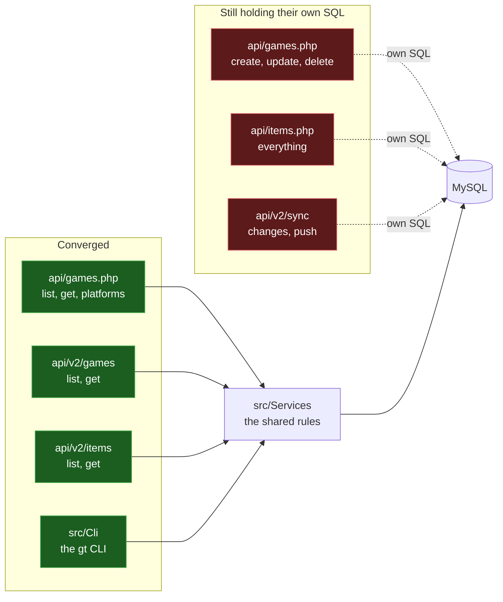
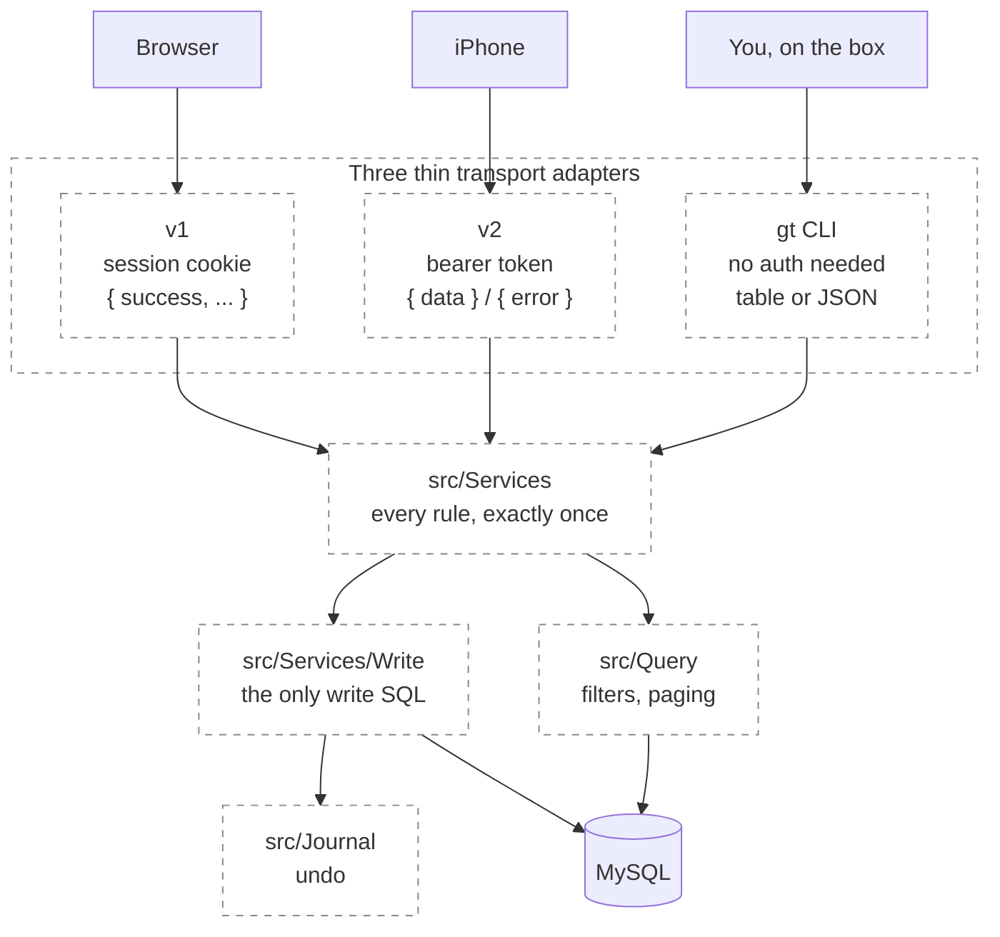

# Level 3 — The refactor in flight

## 5. Convergence map

The same rules once existed three times over: once for the web, once for the
phone, once for the CLI. Sub-project #6b is collapsing them onto `src/Services`.

The useful thing to see here is that this is **not** three copies of everything.
It is a partially completed migration — and this diagram says how far it has got.

Verified against `origin/main` at `3379fce`, 2026-08-04.

| Path | Rules live where |
|---|---|
| `api/games.php` reads — list, get, platforms | `src/Services` |
| `api/games.php` writes — create, update, delete | own SQL |
| `api/items.php` | own SQL |
| `api/v2/games` list + get | `src/Services` |
| `api/v2/items` list + get | `src/Services` |
| `api/v2/sync` changes + push | own SQL |
| `bin/gt` via `src/Cli` | `src/` natively |

The CLI was built on the services from the start, which is why it is the most
complete of the three: filters, writes, journalling and undo all live in `src/`
and nothing else had to be taught them.

### v1's writes are a deliberate stop, not a to-do

Decided 2026-08-04, at the end of sub-project #6b. The three rows above marked
"own SQL" are not simply unconverted — converting them is blocked on something
that is not worth trading away.

Every `apply*` method in `src/Services/Write/` takes a **required**
`JournalWriter`, because journalling there is unconditional by design: a CLI user
can always undo. The journal lives in a home directory, php-fpm runs as
`www-data`, and `www-data` cannot write it.

Giving it write access is the trap. **"Web writes are undoable" and "a
compromised web process cannot erase the undo history" are the same write
permission**, so they cannot both hold — wherever the journal lives, filesystem
or database. The second property is the one worth keeping. So the web app gets no
journal, and its writes are therefore not routed through the writers; wiring them
up anyway would mean a named journal bypass inside `src/Services/Write/`, which is
a footgun for the next CLI command someone adds.

What #6b's writes half delivered instead was the two data-integrity faults that
the duplication was hiding: `deleteGame` no longer unlinks cover files that
surviving rows reference, and neither `createGame` nor `updateGame` donates
another row's cover path. Both were real, both were visible in production data.

Reopening this is a single decision, not a redesign: give the journal a home both
identities can write, accept that a compromised web process could erase it, and
the conversion becomes worthwhile. Until then v1 shares the **services** for reads
and deliberately does not share the **writers** for writes.

**Goes stale when:** any path moves onto or off `src/Services`. A PR that moves
one should update this diagram in the same PR. Also stale if the journal moves
somewhere `www-data` can write, since that is the premise the paragraph above
rests on.

## 6. Target end-state

> **This diagram is aspirational.** It is a reading of where the refactor is
> heading, not a description of code that exists. Diagram 5 is the truth. The gap
> between the two is the roadmap.

In this shape an adapter's only jobs are to authenticate, to translate the wire
format, and to choose an HTTP status. Everything else is shared. The value is not
tidiness: it is that a rule fixed once is fixed everywhere, instead of being
fixed on the phone and left wrong on the web.

**Goes stale when:** the intended end-state changes — including if you decide
against it.
