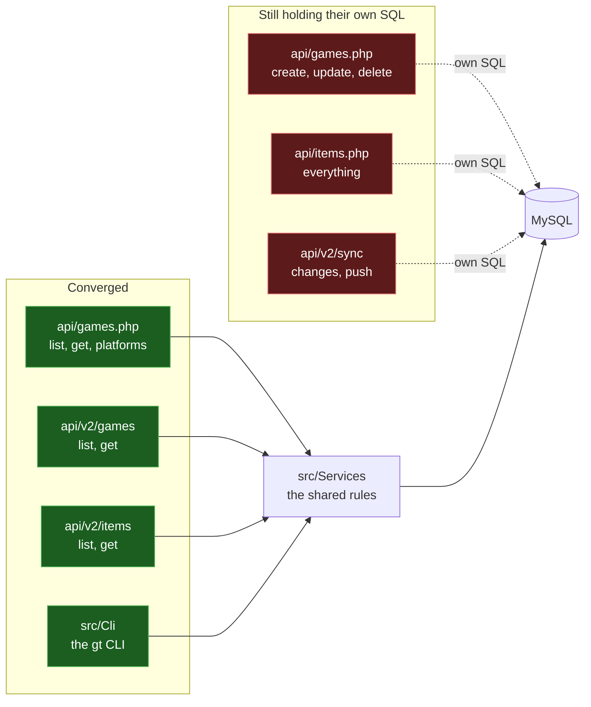
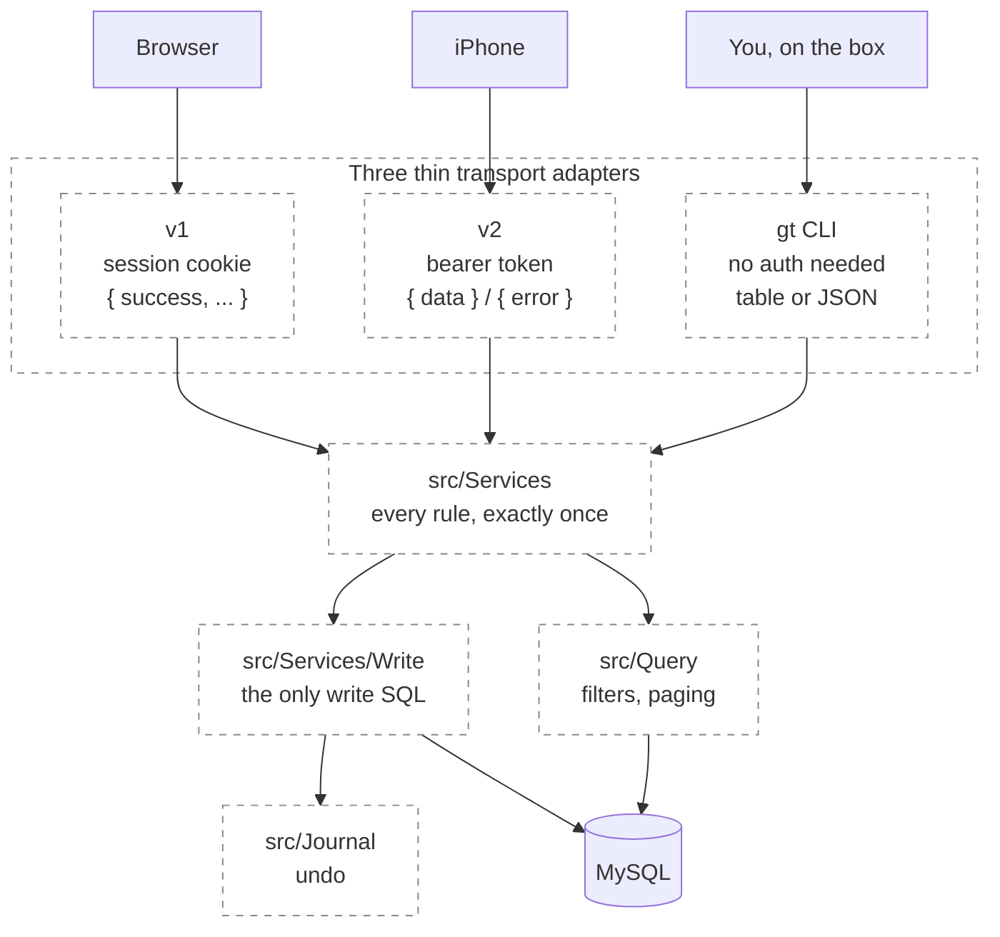

# Level 3 — The refactor in flight

## 5. Convergence map

The same rules once existed three times over: once for the web, once for the
phone, once for the CLI. Sub-project #6b is collapsing them onto `src/Services`.

The useful thing to see here is that this is **not** three copies of everything.
It is a partially completed migration — and this diagram says how far it has got.

Verified against `origin/main` at `3379fce`, 2026-08-04.

| Path | Rules live where |
|---|---|
| `api/games.php` reads — list, get, platforms | `src/Services` |
| `api/games.php` writes — create, update, delete | own SQL |
| `api/items.php` | own SQL |
| `api/v2/games` list + get | `src/Services` |
| `api/v2/items` list + get | `src/Services` |
| `api/v2/sync` changes + push | own SQL |
| `bin/gt` via `src/Cli` | `src/` natively |

The CLI was built on the services from the start, which is why it is the most
complete of the three: filters, writes, journalling and undo all live in `src/`
and nothing else had to be taught them.

**Goes stale when:** any path moves onto or off `src/Services`. A PR that moves
one should update this diagram in the same PR.

## 6. Target end-state

> **This diagram is aspirational.** It is a reading of where the refactor is
> heading, not a description of code that exists. Diagram 5 is the truth. The gap
> between the two is the roadmap.

In this shape an adapter's only jobs are to authenticate, to translate the wire
format, and to choose an HTTP status. Everything else is shared. The value is not
tidiness: it is that a rule fixed once is fixed everywhere, instead of being
fixed on the phone and left wrong on the web.

**Goes stale when:** the intended end-state changes — including if you decide
against it.
