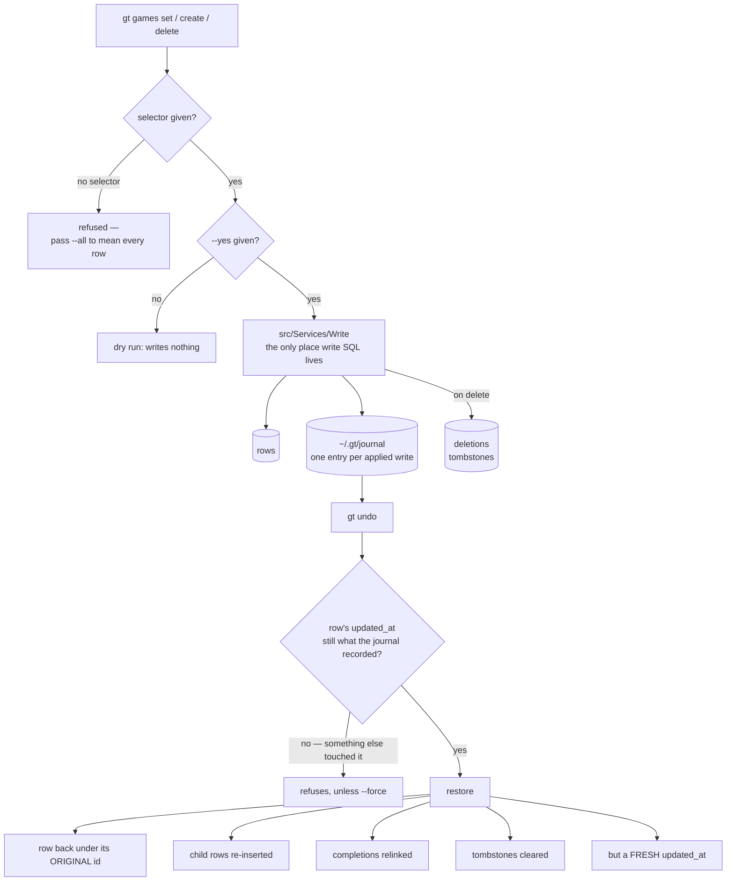
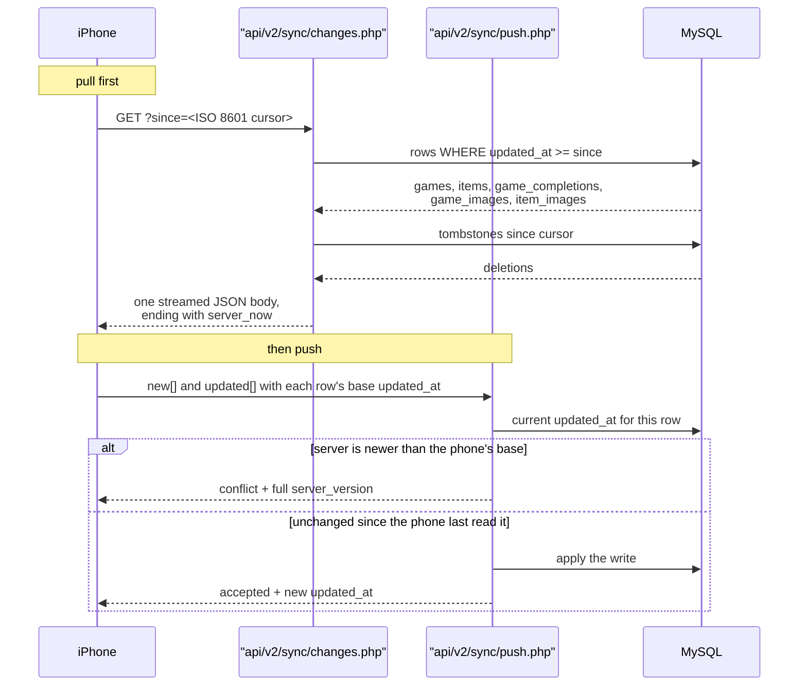
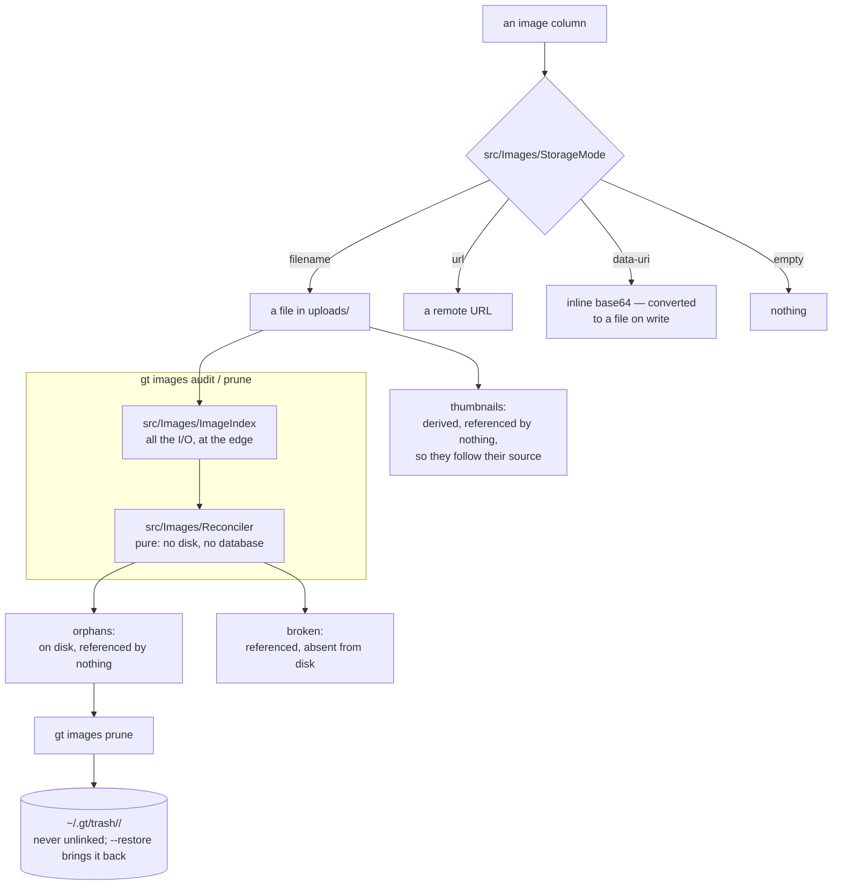

# Level 4 — The three subsystems that don't fit in your head

These are the parts worth re-reading rather than re-deriving.

## 7. Write path: journal, tombstones, undo

**Why a restore takes a fresh `updated_at`, not the original.**
`api/v2/sync/changes.php` only returns rows newer than the client's cursor. A
restored row carrying its original timestamp would sit below the phone's cursor
forever: present on the server, permanently missing on the phone. The fresh
timestamp is what makes the restore visible to sync.

**Delete never unlinks image files.** Several games share one image path, so
removing the file would break a surviving game's cover. Leaving it is also what
makes delete reversible — a `mysqldump` restores rows, not files. Orphaned files
accumulate and `gt images prune` deals with them.

**The confinement is enforced in three layers** by
`tests/cli/test_readonly_guard.sh`, because a guard is only as good as its
non-vacuity: no write SQL outside `src/Services/Write`, that directory must
actually *contain* some, and the matching pattern is itself probed against known
write statements so it cannot silently stop matching.

**Goes stale when:** the journal format, tombstone handling, or undo guards
change.

## 8. iOS delta sync

**The cursor comparison is `>=`, not `>`.** MySQL's `updated_at` has second
precision, so a strict `>` drops any row whose timestamp rounds down to the
cursor value. The overlap that `>=` creates is harmless because the client looks
rows up by `server_id` before inserting or updating — it recognises a row it
already has instead of duplicating it.

Conflict detection is the phone sending back the server's `updated_at` from the
last time it successfully read the row. If the server's current value is newer,
something else edited it in between, and the server returns its full version
rather than choosing a winner.

The response ends with `server_now`, and that value becomes the phone's cursor for
the next pull. It is emitted with whole-second precision, which is the other half
of why the comparison is `>=`: the cursor the client sends back is itself rounded.

**Goes stale when:** the cursor comparison, the set of streamed tables, or the
conflict rule changes.

## 9. Image storage pipeline

An image column holds a **reference**, never an image.

- **`data-uri` is converted to a file on write**, on both create and update,
  regardless of `auto_download`. Before that fix 81 rows held roughly 113 MB of
  base64 — most of the database — and every byte shipped to the phone on each
  delta sync.
- **`prune` never unlinks.** Files move to trash and `--restore` brings them
  back. There is no retention policy and no `empty` command, deliberately:
  sweeping the safety net on a timer defeats it.
- **`ImageIndex` does the I/O; `Reconciler` is pure.** The expensive filesystem
  and database work happens once at the edge, which lets the comparison logic be
  tested exhaustively without building fixture trees.
- **`audit` and `prune` derive the uploads directory from the same
  `includes/config.php` that provides `$pdo`**, so disk and database always
  describe one install. If most referenced files look absent, `audit` warns and
  `prune` refuses — that means the wrong directory far more often than a vanished
  collection. This is also why `gt doctor` must be run from the production
  checkout.
- Thumbnails are derived and referenced by nothing, so a naive "delete
  unreferenced files" sweep would destroy nearly all of them.

**Goes stale when:** a storage mode is added, or the trash and prune policy
changes.
