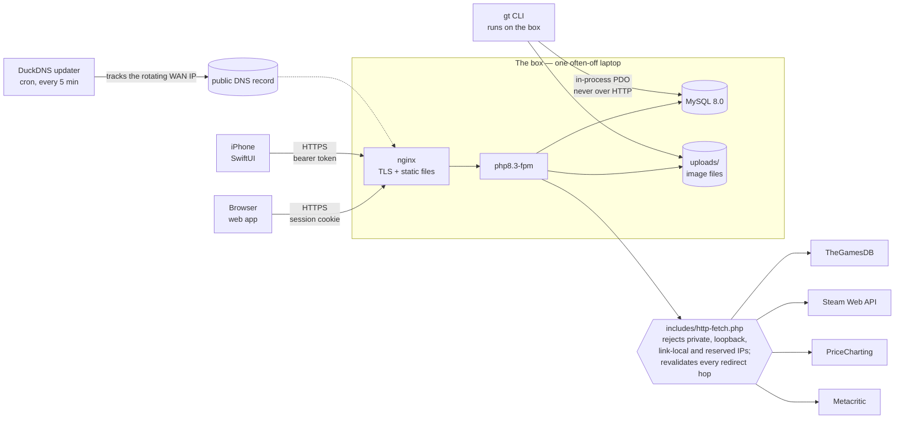
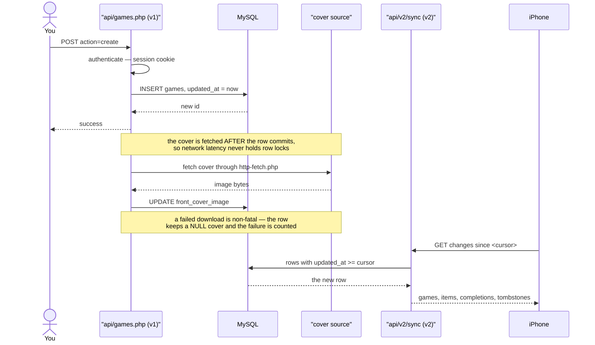
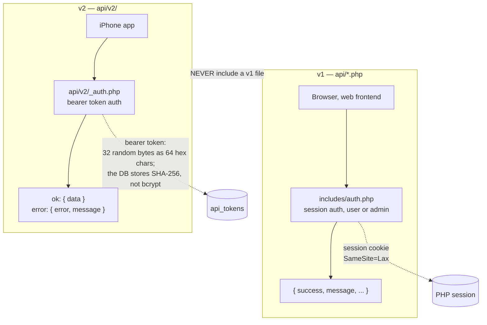
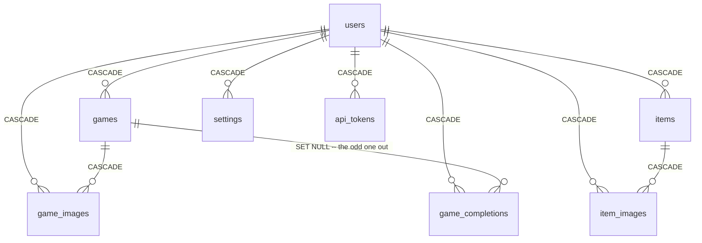
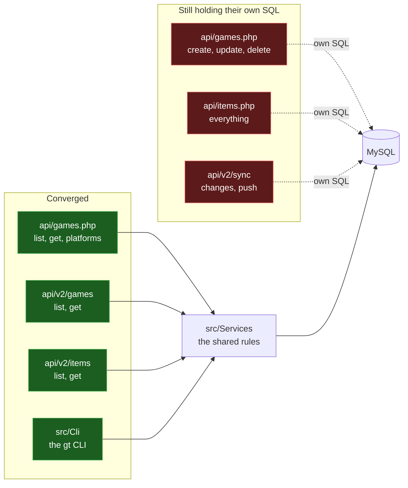
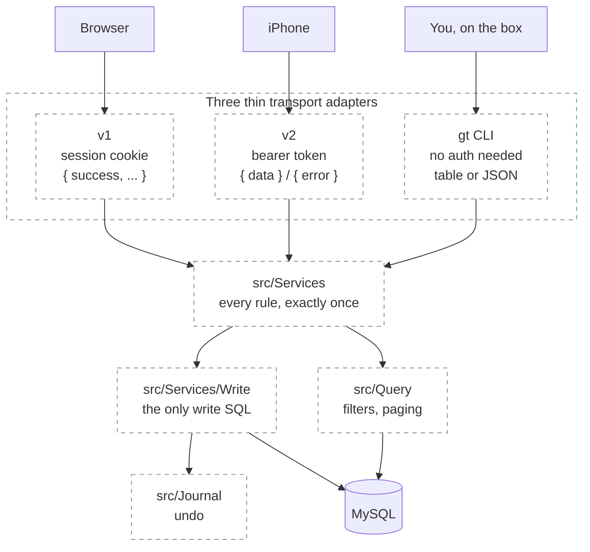
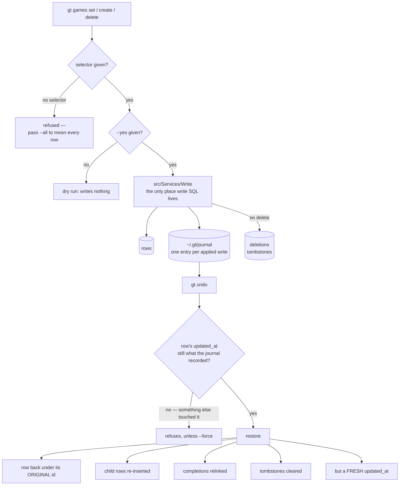
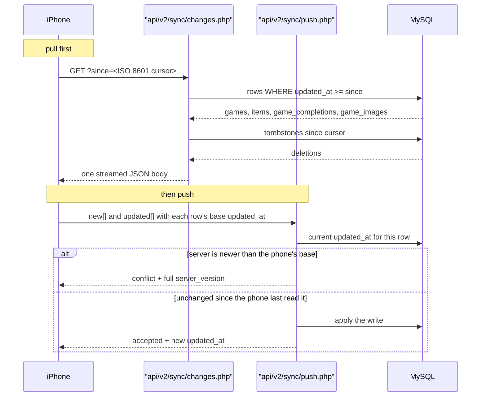
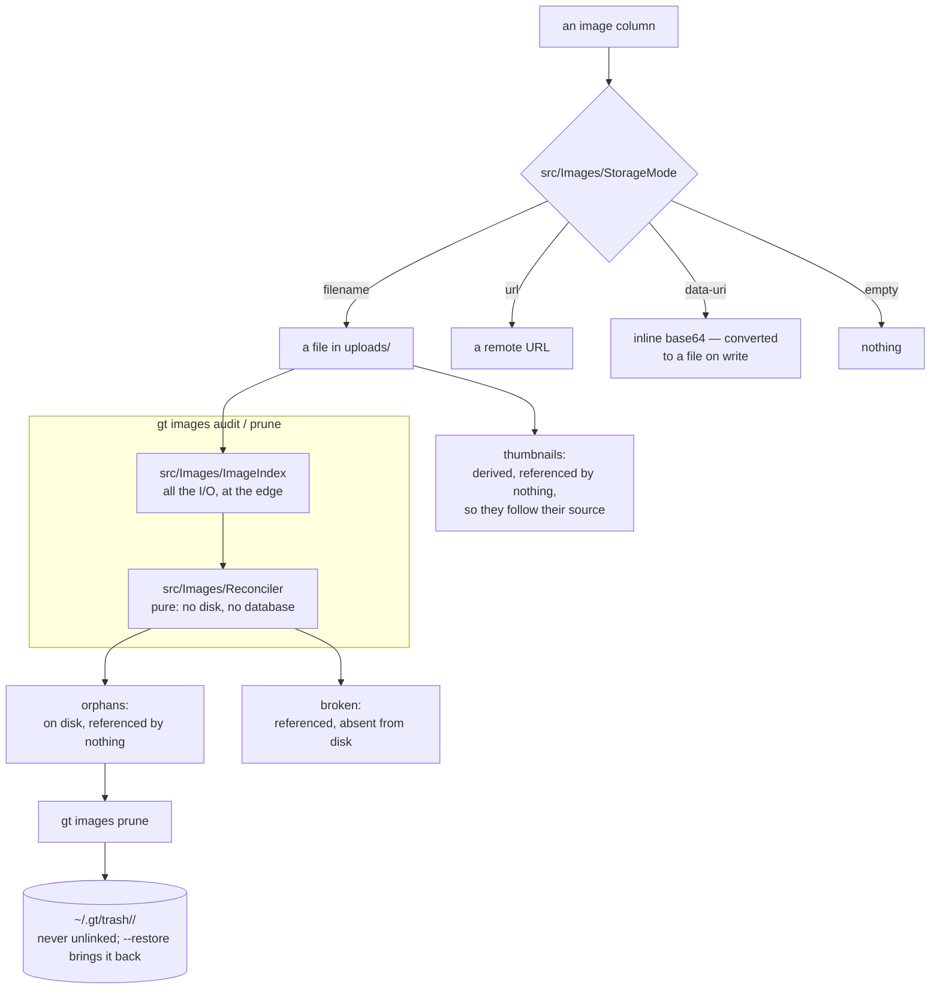

# Architecture Diagrams Implementation Plan

> **For agentic workers:** REQUIRED SUB-SKILL: Use superpowers:subagent-driven-development (recommended) or superpowers:executing-plans to implement this plan task-by-task. Steps use checkbox (`- [ ]`) syntax for tracking.

**Goal:** Add nine mermaid architecture diagrams across four levels in `docs/architecture/`, guarded by an automated staleness test, and publish them as one readable page.

**Architecture:** Markdown-with-mermaid in `docs/architecture/`, one file per level, indexed by a `README.md`. GitHub and Artifacts both render mermaid natively, so the same source serves both — the repo is the source of truth and the published page is a reading view. A new `tests/docs/` suite makes the two rot modes that are otherwise silent into loud failures: a mermaid block that does not parse, and a repo path that no longer exists.

**Tech Stack:** Markdown, mermaid (no new dependencies — no mermaid-cli, no puppeteer), bash for the test suite, the existing `tests/v2/lib.sh` helpers.

**Source spec:** `docs/superpowers/specs/2026-08-04-architecture-diagrams-design.md`

## Global Constraints

- **Navigation is an explicit non-goal.** No function names, no line numbers.
  File paths only where the path *is* the architectural fact (`src/Services`,
  `api/v2/`), and class names only where the class *is* the unit the diagram is
  about (`StorageMode`, `Reconciler`). Clarified 2026-08-04 after the Task 1+2
  review found `requireUser()` in diagram 2, mandated by the plan's own text: a
  bare function name is pure navigation detail and the most rot-prone content
  here, so it is replaced by what it does. A class arriving as a
  `src/Images/…` path is already covered by the path carve-out.
- **Every factual claim must trace to code or the database**, not memory. Facts in this plan were read from `origin/main` at `3379fce` and the live database on 2026-08-04.
- **No stated repo path may fail to exist.** Task 1's test enforces this.
- **Diagram 6 must be marked aspirational** both visually (dashed borders) and in prose.
- **Every diagram carries a `**Goes stale when:**` line.** Task 1's test enforces this.
- **Row counts are dated snapshots**, written as "as of 2026-08-04", never as standing facts.
- No new npm dependencies. This box runs Node 18; ESLint 10 and mermaid-cli are both off-limits.
- Documentation only — no change to any `.php`, `.js`, or `database/` file.

---

## File Structure

| File | Responsibility |
|---|---|
| `docs/architecture/README.md` | Index: the nine diagrams, how to read them, when to update them |
| `docs/architecture/1-outside.md` | Diagrams 1-2 — system context, user journey |
| `docs/architecture/2-apis.md` | Diagrams 3-4 — v1 vs v2, data model |
| `docs/architecture/3-refactor.md` | Diagrams 5-6 — convergence map, target end-state |
| `docs/architecture/4-subsystems.md` | Diagrams 7-9 — write path, sync, images |
| `tests/docs/test_architecture_docs.sh` | Structural + staleness checks |
| `tests/v2/run-all.sh` | Modify: add a third suite loop for `tests/docs/` |
| `README.md` | Modify: point the existing ASCII sketch at the new index |

**Why the test is count-agnostic until Task 6:** it validates strictly whatever diagrams exist, so every intermediate commit is green. The "all nine present" assertion lands in Task 6 once they all do. A suite that is knowingly red for four commits trains people to ignore it.

---

### Task 1: Docs test harness and index

**Files:**
- Create: `tests/docs/test_architecture_docs.sh`
- Create: `docs/architecture/README.md`
- Modify: `tests/v2/run-all.sh` (add a third suite loop after the `tests/cli/` loop)

**Interfaces:**
- Consumes: `tests/v2/lib.sh` — `red()`, `green()`, `blue()`, `assert_eq()`, `summarize()`, and the `PASS_COUNT` / `FAIL_COUNT` globals. It sets `BASE_URL`/`TEST_USER` too, but this suite uses neither, so it needs no server and no database.
- Produces: `tests/docs/test_architecture_docs.sh`, runnable standalone as `bash tests/docs/test_architecture_docs.sh` from the repo root, exit 0 on pass and 1 on failure. Later tasks rely on it accepting new files in `docs/architecture/` without modification.

- [ ] **Step 1: Write the failing test**

Create `tests/docs/test_architecture_docs.sh`:

```bash
#!/usr/bin/env bash
# Structural checks on docs/architecture/.
#
# Documentation rots silently. These make the two failure modes that are
# otherwise invisible into loud ones:
#
#   1. A mermaid block that does not declare a diagram type renders as a raw
#      code fence on GitHub. It looks like a formatting mistake rather than a
#      broken diagram, so nobody reports it.
#   2. A diagram naming a directory that has since been moved or renamed is the
#      first symptom of a stale diagram, and the cheapest one to detect.
#
# Needs no server and no database — it only reads files.
source "$(dirname "$0")/../v2/lib.sh"

ROOT="$(cd "$(dirname "$0")/../.." && pwd)"
DOCS="$ROOT/docs/architecture"

blue "docs/architecture exists"

if [[ -d "$DOCS" ]]; then
  green "  PASS: docs/architecture/ exists"
  PASS_COUNT=$((PASS_COUNT+1))
else
  red "  FAIL: docs/architecture/ is missing"
  FAIL_COUNT=$((FAIL_COUNT+1))
  summarize
fi

assert_eq "yes" "$([[ -s "$DOCS/README.md" ]] && echo yes || echo no)" \
  "README.md index is present and non-empty"

blue "mermaid blocks declare a parsable diagram type"

# Every opening ```mermaid fence must be followed by a line naming a diagram
# type mermaid recognises. This is the cheap half of "does it render" — a full
# parse would need mermaid-cli, which drags in puppeteer and Chromium, and this
# box runs Node 18.
MERMAID_TYPES='^[[:space:]]*(flowchart|graph|sequenceDiagram|erDiagram|classDiagram|stateDiagram(-v2)?|journey|gantt|pie|mindmap|timeline|block-beta)\b'
BLOCKS=0
BAD_TYPE=0
for f in "$DOCS"/*.md; do
  [[ -e "$f" ]] || continue
  while IFS= read -r lineno; do
    BLOCKS=$((BLOCKS+1))
    next=$(sed -n "$((lineno+1))p" "$f")
    if ! echo "$next" | grep -qE "$MERMAID_TYPES"; then
      red "    $(basename "$f"):$lineno — block opens with: ${next:0:60}"
      BAD_TYPE=$((BAD_TYPE+1))
    fi
  done < <(grep -n '^```mermaid$' "$f" | cut -d: -f1)
done

assert_eq "0" "$BAD_TYPE" "every mermaid block declares a known diagram type ($BLOCKS blocks checked)"

# Non-vacuity: the loop above passes trivially if it found nothing.
if [[ "$BLOCKS" -gt 0 ]]; then
  green "  PASS: found $BLOCKS mermaid blocks to check"
  PASS_COUNT=$((PASS_COUNT+1))
else
  red "  FAIL: no mermaid blocks found — the type check above was vacuous"
  FAIL_COUNT=$((FAIL_COUNT+1))
fi

blue "code fences are balanced"

for f in "$DOCS"/*.md; do
  [[ -e "$f" ]] || continue
  n=$(grep -c '^```' "$f" || true)
  if (( n % 2 == 0 )); then
    green "  PASS: $(basename "$f") has balanced fences ($n)"
    PASS_COUNT=$((PASS_COUNT+1))
  else
    red "  FAIL: $(basename "$f") has an odd number of fences ($n) — one is unclosed"
    FAIL_COUNT=$((FAIL_COUNT+1))
  fi
done

blue "every repo path named in the docs exists"

# The real rot detector. Only repo-relative paths are checked: a token starting
# with ~ or / is external (~/.gt/trash, /etc/nginx/...) and not ours to verify.
MISSING=0
CHECKED=0
for f in "$DOCS"/*.md; do
  [[ -e "$f" ]] || continue
  # Backticked tokens beginning with a real top-level directory of this repo.
  while IFS= read -r p; do
    [[ -z "$p" ]] && continue
    CHECKED=$((CHECKED+1))
    if [[ ! -e "$ROOT/${p%/}" ]]; then
      red "    $(basename "$f"): '$p' does not exist"
      MISSING=$((MISSING+1))
    fi
  done < <(grep -oE '`(api|src|tests|includes|js|css|database|scripts|docs|bin|ios)/[A-Za-z0-9_./*-]+`' "$f" \
             | tr -d '`' | grep -v '[*]' | sort -u)
done

assert_eq "0" "$MISSING" "all $CHECKED repo paths named in the docs exist"

if [[ "$CHECKED" -gt 0 ]]; then
  green "  PASS: found $CHECKED repo paths to check"
  PASS_COUNT=$((PASS_COUNT+1))
else
  red "  FAIL: no repo paths found — the existence check above was vacuous"
  FAIL_COUNT=$((FAIL_COUNT+1))
fi

blue "every diagram declares what makes it stale"

# Each diagram is an '## <n>. <title>' heading. Diagrams in git that nobody
# updates are worse than none, so each must name the change that invalidates it.
NO_STALE=0
DIAGRAMS=0
for f in "$DOCS"/*.md; do
  [[ -e "$f" ]] || continue
  [[ "$(basename "$f")" == "README.md" ]] && continue
  while IFS= read -r h; do
    DIAGRAMS=$((DIAGRAMS+1))
    lineno="${h%%:*}"
    title="${h#*:}"
    # Range runs to the line BEFORE the next '## ' heading, so a diagram can
    # never satisfy this check using its neighbour's content.
    end=$(awk -v s="$lineno" 'NR>s && /^## /{print NR-1; exit}' "$f")
    [[ -z "$end" ]] && end=$(wc -l < "$f")
    if ! sed -n "${lineno},${end}p" "$f" | grep -q '\*\*Goes stale when:\*\*'; then
      red "    $(basename "$f"): '$title' has no 'Goes stale when:' line"
      NO_STALE=$((NO_STALE+1))
    fi
  done < <(grep -nE '^## [0-9]+\. ' "$f")
done

assert_eq "0" "$NO_STALE" "all $DIAGRAMS diagrams carry a 'Goes stale when' line"

summarize
```

Make it executable:

```bash
chmod +x tests/docs/test_architecture_docs.sh
```

- [ ] **Step 2: Run the test to verify it fails**

Run: `cd ~/worktrees/archdiagrams && bash tests/docs/test_architecture_docs.sh`
Expected: FAIL — `docs/architecture/ is missing`, exit 1.

- [ ] **Step 3: Create the index**

Create `docs/architecture/README.md`:

````markdown
# gameTracker architecture

Nine diagrams at four levels of abstraction. Start at level 1 and go down only
as far as you need.

These are for **re-orienting** after time away, for **seeing the shape of the
in-flight refactor**, and for **explaining the system to someone else**.

They are deliberately **not a navigation aid**. There are no function names and
no line numbers, and file paths appear only where the path is itself the
architectural fact. If you are looking for which file to edit, read the code.

| Level | Diagram | File |
|---|---|---|
| 1 — from outside | 1. System context | [1-outside.md](1-outside.md) |
| | 2. User journey | [1-outside.md](1-outside.md) |
| 2 — the two generations | 3. v1 vs v2 | [2-apis.md](2-apis.md) |
| | 4. Data model | [2-apis.md](2-apis.md) |
| 3 — the refactor in flight | 5. Convergence map | [3-refactor.md](3-refactor.md) |
| | 6. Target end-state *(aspirational)* | [3-refactor.md](3-refactor.md) |
| 4 — subsystems | 7. Write path: journal, tombstones, undo | [4-subsystems.md](4-subsystems.md) |
| | 8. iOS delta sync | [4-subsystems.md](4-subsystems.md) |
| | 9. Image storage pipeline | [4-subsystems.md](4-subsystems.md) |

## Keeping these honest

Every diagram carries a **"Goes stale when:"** line naming the change that
invalidates it. `tests/docs/test_architecture_docs.sh` enforces that the line
exists, that every mermaid block declares a parsable diagram type, and that
every repo path named here still exists — that last one is what actually catches
drift.

**Diagram 5 moves most.** It maps which code paths have converged onto
`src/Services`, so any PR that moves a path on or off the services should update
it in the same PR.

Row counts and similar figures are dated snapshots ("as of 2026-08-04"), not
standing facts, and are allowed to drift.
````

- [ ] **Step 4: Wire the suite into the runner**

In `tests/v2/run-all.sh`, after the existing `tests/cli/` loop, add a third loop
following the same nullglob-guarded pattern:

```bash
# Docs suites (tests/docs/). These read files only — no server, no database —
# but they ride along here so CI runs them with everything else.
for test in "$PROJECT_ROOT"/tests/docs/test_*.sh; do
  echo "=== docs/$(basename "$test") ==="
  if ! bash "$test"; then
    OVERALL_FAIL=1
  fi
  echo
done
```

`shopt -s nullglob` is already set by the `tests/cli/` loop above, so this loop
inherits it; do not set it twice.

- [ ] **Step 5: Run the test to verify it passes**

Run: `cd ~/worktrees/archdiagrams && bash tests/docs/test_architecture_docs.sh`
Expected: FAIL still — the index has no mermaid blocks and no diagrams, so the
two non-vacuity assertions fire: "no mermaid blocks found" and "no repo paths
found".

This is the correct intermediate state and the reason Task 2 follows
immediately. Confirm the *only* failures are those two non-vacuity assertions,
then proceed. Do not commit yet.

- [ ] **Step 6: Verify the runner wiring is syntactically sound**

Run: `bash -n tests/v2/run-all.sh`
Expected: no output, exit 0.

---

### Task 2: Level 1 — system context and user journey

**Files:**
- Create: `docs/architecture/1-outside.md`

**Interfaces:**
- Consumes: the heading convention `## <n>. <title>` and the `**Goes stale when:**` line format that `tests/docs/test_architecture_docs.sh` greps for. Both are load-bearing — the test fails without them.
- Produces: diagrams 1 and 2. Nothing depends on them.

- [ ] **Step 1: Write the file**

Create `docs/architecture/1-outside.md`:

````markdown
# Level 1 — The system from outside

## 1. System context

One intermittently-powered laptop serves three different consumers, and reaches
four external services through a single guarded exit.



Three things this diagram is trying to tell you:

- **The CLI is not a client.** `gt` talks to MySQL in-process through the same
  `includes/config.php` that gives the web app its `$pdo`. It never goes over
  HTTP, so it needs no auth token and is unaffected by nginx.
- **There is exactly one exit to the internet.** Every external fetch goes
  through `includes/http-fetch.php`. Calling `file_get_contents` or curl on a
  user-supplied URL anywhere else reopens the SSRF hole that
  `tests/v2/test_ssrf.sh` and `tests/v2/test_v2_cover_ssrf.sh` guard.
- **If the site resolves on the LAN but not by name, suspect DNS first.** The
  WAN IP rotates and a cron job chases it.

**Goes stale when:** a new external service is called, the box's stack changes,
or the SSRF guard stops being the single exit.

## 2. User journey

One game, from typing it in to it appearing on the phone. The least detailed
diagram here on purpose — it exists to make the other eight legible.



**Goes stale when:** the create path changes, or covers stop being fetched after
commit.
````

- [ ] **Step 2: Run the test to verify it passes**

Run: `cd ~/worktrees/archdiagrams && bash tests/docs/test_architecture_docs.sh`
Expected: PASS, exit 0. Both non-vacuity assertions now satisfied — mermaid
blocks found, repo paths found, and both diagrams carry a "Goes stale when" line.

- [ ] **Step 3: Commit**

```bash
git add tests/docs/test_architecture_docs.sh tests/v2/run-all.sh docs/architecture/
git commit -m "docs(architecture): level 1 diagrams and a staleness test

Adds docs/architecture/ with the index and level 1 — system context and the
user journey — plus tests/docs/test_architecture_docs.sh, wired into
run-all.sh.

The test exists because documentation rots silently. It makes the two invisible
failure modes loud: a mermaid block with no diagram type renders as a raw code
fence on GitHub and looks like a formatting slip, and a diagram naming a
directory that has moved is the first symptom of staleness. Both non-vacuity
guards are deliberate — the path and mermaid checks would otherwise pass by
finding nothing.

No mermaid-cli: it needs puppeteer and Chromium, and this box runs Node 18. The
type check is the cheap half; rendering is confirmed on the published page."
```

---

### Task 3: Level 2 — the two API generations and the data model

**Files:**
- Create: `docs/architecture/2-apis.md`

**Interfaces:**
- Consumes: the heading and "Goes stale when" conventions from Task 2.
- Produces: diagrams 3 and 4. Diagram 5 in Task 4 assumes the reader has met the v1/v2 distinction here.

- [ ] **Step 1: Write the file**

Create `docs/architecture/2-apis.md`:

````markdown
# Level 2 — The two generations

## 3. v1 vs v2

Two parallel API generations with different auth, different response shapes and
different include graphs. This is the single biggest source of confusion in the
codebase, which is why it gets a diagram rather than a paragraph.



| | v1 | v2 |
|---|---|---|
| Lives in | `api/*.php` | `api/v2/` |
| Serves | the web frontend | the iOS app |
| Auth | session cookie | bearer token, *or* an active session |
| Success shape | `{ success: true, ... }` | `{ data: ... }` |
| Error shape | `{ success: false, message }` | `{ error: "slug", message }` |
| Mutations | must be POST — 405 otherwise | per-endpoint |

Things worth knowing that the boxes cannot show:

- **SHA-256 rather than bcrypt is deliberate**, not an oversight. A token is 32
  bytes of entropy already, so the hash only needs to be a cheap deterministic
  lookup key.
- **v2 never includes a v1 file.** An earlier design set `$_SESSION` and
  installed an output buffer to reshape v1 responses into v2 shape. That is gone;
  do not reintroduce it.
- **POST-only mutation plus `SameSite=Lax` is what currently stands in for full
  CSRF enforcement** on v1. `includes/csrf.php` exists and is waiting on the
  frontend rewrite.
- The browser is deliberately never issued a bearer token: an HttpOnly session
  cookie cannot be read by injected JS, and any token the frontend could attach
  could also be stolen.

**Goes stale when:** auth or response shape changes on either generation, or the
v1/v2 isolation rule is relaxed.

## 4. Data model

Twelve tables. The delete rules on the edges *are* the behaviour, so they are
drawn rather than described.



Standalone tables with no foreign keys: `deletions` (tombstones, not domain
data), `schema_migrations` (the migration ledger), `security_logs`,
`rate_limits`.

**`game_completions.game_id` is the only `ON DELETE SET NULL`** in the schema.
Every other child cascades. That single asymmetry is the sync bug the writes half
of sub-project #6b closes: deleting a game silently orphans its completion rows
instead of removing them, and nothing tells the phone. `gt`'s delete already
journals and relinks them; the web path does not yet.

Row counts **as of 2026-08-04** — a dated snapshot, not a standing fact:

| Table | Rows |
|---|---|
| `games` | 1,042 |
| `items` | 108 |
| `game_completions` | 51 |
| `api_tokens` | 17 |
| `deletions` | 13 |
| `game_images` | **0** |
| `item_images` | **0** |

Both image tables being empty is worth noticing: the extra-images feature has
produced no rows at all. The `uploads/` directory did not survive the December
2025 server rebuild, so the innocent explanation is that those rows went with it
and nothing has added any since.

**Goes stale when:** a migration adds or removes a table, or changes a delete
rule.
````

- [ ] **Step 2: Run the test to verify it passes**

Run: `cd ~/worktrees/archdiagrams && bash tests/docs/test_architecture_docs.sh`
Expected: PASS, exit 0, with 4 diagrams now counted.

- [ ] **Step 3: Verify the mermaid `x--x` edge renders**

The `v2 x--x|label| v1` crossed edge in diagram 3 is less common than the arrow
forms. If the published page in Task 7 shows it as an error, replace that line
with a plain dashed edge and a `NEVER` label:

```
    v2 -.->|"NEVER include a v1 file"| v1
```

Note the substitution in the commit message if you make it.

- [ ] **Step 4: Commit**

```bash
git add docs/architecture/2-apis.md
git commit -m "docs(architecture): level 2 — the two API generations and the data model

The v1/v2 split gets a full diagram because CLAUDE.md calls it the single
biggest source of confusion in the codebase.

The data model draws FK delete rules on the edges, because those rules are the
behaviour: game_completions.game_id is the lone ON DELETE SET NULL against nine
CASCADEs, and that asymmetry is exactly the sync bug #6b's writes half closes.

Row counts are labelled as a 2026-08-04 snapshot. Recorded that game_images and
item_images both hold 0 rows, which is new information rather than a diagram
detail."
```

---

### Task 4: Level 3 — the refactor in flight

**Files:**
- Create: `docs/architecture/3-refactor.md`

**Interfaces:**
- Consumes: the heading and "Goes stale when" conventions.
- Produces: diagrams 5 and 6. Diagram 5 is the one future PRs are expected to update.

- [ ] **Step 1: Write the file**

Create `docs/architecture/3-refactor.md`:

````markdown
# Level 3 — The refactor in flight

## 5. Convergence map

The same rules once existed three times over: once for the web, once for the
phone, once for the CLI. Sub-project #6b is collapsing them onto `src/Services`.

The useful thing to see here is that this is **not** three copies of everything.
It is a partially completed migration — and this diagram says how far it has got.

Verified against `origin/main` at `3379fce`, 2026-08-04.



| Path | Rules live where |
|---|---|
| `api/games.php` reads — list, get, platforms | `src/Services` |
| `api/games.php` writes — create, update, delete | own SQL |
| `api/items.php` | own SQL |
| `api/v2/games` list + get | `src/Services` |
| `api/v2/items` list + get | `src/Services` |
| `api/v2/sync` changes + push | own SQL |
| `bin/gt` via `src/Cli` | `src/` natively |

The CLI was built on the services from the start, which is why it is the most
complete of the three: filters, writes, journalling and undo all live in `src/`
and nothing else had to be taught them.

**Goes stale when:** any path moves onto or off `src/Services`. A PR that moves
one should update this diagram in the same PR.

## 6. Target end-state

> **This diagram is aspirational.** It is a reading of where the refactor is
> heading, not a description of code that exists. Diagram 5 is the truth. The gap
> between the two is the roadmap.



In this shape an adapter's only jobs are to authenticate, to translate the wire
format, and to choose an HTTP status. Everything else is shared. The value is not
tidiness: it is that a rule fixed once is fixed everywhere, instead of being
fixed on the phone and left wrong on the web.

**Goes stale when:** the intended end-state changes — including if you decide
against it.
````

- [ ] **Step 2: Run the test to verify it passes**

Run: `cd ~/worktrees/archdiagrams && bash tests/docs/test_architecture_docs.sh`
Expected: PASS, exit 0, with 6 diagrams counted.

- [ ] **Step 3: Commit**

```bash
git add docs/architecture/3-refactor.md
git commit -m "docs(architecture): level 3 — convergence map and target end-state

The convergence map carries the insight that made this worth drawing: the
duplication is not three copies of everything, it is a partially completed
migration onto src/Services, and the map says how far it has got. Verified
against origin/main at 3379fce rather than from memory.

The target diagram is marked aspirational in prose and with dashed borders. It
is an interpretation of direction, not a claim about existing code, and it is
the diagram most likely to need correcting."
```

---

### Task 5: Level 4 — write path, sync, images

**Files:**
- Create: `docs/architecture/4-subsystems.md`

**Interfaces:**
- Consumes: the heading and "Goes stale when" conventions.
- Produces: diagrams 7, 8 and 9 — the last three, bringing the total to nine for Task 6's completeness assertion.

- [ ] **Step 1: Write the file**

Create `docs/architecture/4-subsystems.md`:

````markdown
# Level 4 — The three subsystems that don't fit in your head

These are the parts worth re-reading rather than re-deriving.

## 7. Write path: journal, tombstones, undo



**Why a restore takes a fresh `updated_at`, not the original.**
`api/v2/sync/changes.php` only returns rows newer than the client's cursor. A
restored row carrying its original timestamp would sit below the phone's cursor
forever: present on the server, permanently missing on the phone. The fresh
timestamp is what makes the restore visible to sync.

**Delete never unlinks image files.** Several games share one image path, so
removing the file would break a surviving game's cover. Leaving it is also what
makes delete reversible — a `mysqldump` restores rows, not files. Orphaned files
accumulate and `gt images prune` deals with them.

**The confinement is enforced in three layers** by
`tests/cli/test_readonly_guard.sh`, because a guard is only as good as its
non-vacuity: no write SQL outside `src/Services/Write`, that directory must
actually *contain* some, and the matching pattern is itself probed against known
write statements so it cannot silently stop matching.

**Goes stale when:** the journal format, tombstone handling, or undo guards
change.

## 8. iOS delta sync



**The cursor comparison is `>=`, not `>`.** MySQL's `updated_at` has second
precision, so a strict `>` drops any row whose timestamp rounds down to the
cursor value. The overlap that `>=` creates is harmless because the client looks
rows up by `server_id` before inserting or updating — it recognises a row it
already has instead of duplicating it.

Conflict detection is the phone sending back the server's `updated_at` from the
last time it successfully read the row. If the server's current value is newer,
something else edited it in between, and the server returns its full version
rather than choosing a winner.

**Goes stale when:** the cursor comparison, the set of streamed tables, or the
conflict rule changes.

## 9. Image storage pipeline

An image column holds a **reference**, never an image.



- **`data-uri` is converted to a file on write**, on both create and update,
  regardless of `auto_download`. Before that fix 81 rows held roughly 113 MB of
  base64 — most of the database — and every byte shipped to the phone on each
  delta sync.
- **`prune` never unlinks.** Files move to trash and `--restore` brings them
  back. There is no retention policy and no `empty` command, deliberately:
  sweeping the safety net on a timer defeats it.
- **`ImageIndex` does the I/O; `Reconciler` is pure.** The expensive filesystem
  and database work happens once at the edge, which lets the comparison logic be
  tested exhaustively without building fixture trees.
- **`audit` and `prune` derive the uploads directory from the same
  `includes/config.php` that provides `$pdo`**, so disk and database always
  describe one install. If most referenced files look absent, `audit` warns and
  `prune` refuses — that means the wrong directory far more often than a vanished
  collection. This is also why `gt doctor` must be run from the production
  checkout.
- Thumbnails are derived and referenced by nothing, so a naive "delete
  unreferenced files" sweep would destroy nearly all of them.

**Goes stale when:** a storage mode is added, or the trash and prune policy
changes.
````

- [ ] **Step 2: Run the test to verify it passes**

Run: `cd ~/worktrees/archdiagrams && bash tests/docs/test_architecture_docs.sh`
Expected: PASS, exit 0, with 9 diagrams counted.

- [ ] **Step 3: Commit**

```bash
git add docs/architecture/4-subsystems.md
git commit -m "docs(architecture): level 4 — write path, sync and images

The three subsystems worth re-reading rather than re-deriving, each built around
the non-obvious fact at its centre:

  - a restore takes a FRESH updated_at, because sync only returns rows newer
    than the client's cursor and the original timestamp would leave a row
    present on the server and permanently missing on the phone
  - the sync cursor compares >= rather than >, because MySQL's second precision
    would let a strict > drop a row that rounds down; ChangeApplier's server_id
    lookup makes the resulting overlap harmless
  - an image column holds a reference, never an image, and prune moves files to
    trash rather than unlinking because several games share one path"
```

---

### Task 6: Completeness assertion and README link

**Files:**
- Modify: `tests/docs/test_architecture_docs.sh` (append before `summarize`)
- Modify: `README.md` (add a pointer after the existing ASCII diagram)

**Interfaces:**
- Consumes: the nine diagrams from Tasks 2-5, and the `DIAGRAMS` counter already computed by the staleness loop in Task 1's script.
- Produces: the final guarantee that all nine diagrams and all five files exist.

- [ ] **Step 1: Write the failing assertion**

In `tests/docs/test_architecture_docs.sh`, insert immediately **before** the
final `summarize` call:

```bash
blue "the set is complete"

# Now that all nine exist, assert the count. Until this point the suite was
# deliberately count-agnostic so that every intermediate commit stayed green —
# a suite that is knowingly red for several commits trains people to ignore it.
assert_eq "9" "$DIAGRAMS" "all nine diagrams are present"

for expected in README.md 1-outside.md 2-apis.md 3-refactor.md 4-subsystems.md; do
  assert_eq "yes" "$([[ -s "$DOCS/$expected" ]] && echo yes || echo no)" \
    "$expected is present and non-empty"
done

# Every diagram the index advertises must actually exist as a heading.
INDEX_ROWS=$(grep -cE '^\| *[0-9]+\. |^\| *\| *[0-9]+\. ' "$DOCS/README.md" || true)
assert_eq "9" "$INDEX_ROWS" "the index lists all nine diagrams"
```

- [ ] **Step 2: Run the test to verify the new assertions pass**

Run: `cd ~/worktrees/archdiagrams && bash tests/docs/test_architecture_docs.sh`
Expected: PASS, exit 0, including "all nine diagrams are present".

If `INDEX_ROWS` does not come out as 9, print what it matched and adjust the
regex to the index's actual table formatting rather than editing the index to
suit the regex:

```bash
grep -nE '^\|' docs/architecture/README.md
```

- [ ] **Step 3: Prove the completeness assertion is not vacuous**

Temporarily break it and confirm the suite goes red:

```bash
mv docs/architecture/4-subsystems.md /tmp/4-subsystems.md
bash tests/docs/test_architecture_docs.sh; echo "exit=$?"
mv /tmp/4-subsystems.md docs/architecture/4-subsystems.md
bash tests/docs/test_architecture_docs.sh; echo "exit=$?"
```

Expected: first run FAILS (exit 1) reporting 6 diagrams rather than 9 and the
missing file; second run PASSES (exit 0). A completeness check that cannot fail
is worse than none.

- [ ] **Step 4: Link the index from the main README**

In `README.md`, immediately after the closing fence of the existing ASCII
architecture diagram (around line 63), add:

```markdown
That is the thumbnail. For the detail — the two API generations, the data model,
the in-flight service refactor and the three subsystems worth re-reading — see
[docs/architecture/](docs/architecture/README.md).
```

Leave the ASCII sketch itself alone. It is a perfectly good thumbnail and it
renders anywhere.

- [ ] **Step 5: Run the full harness**

Run:

```bash
cd ~/worktrees/archdiagrams
TEST_DB_USER=CammyBlack02 \
TEST_DB_PASS="$(grep -m1 '^password=' ~/.my.cnf | cut -d= -f2- | tr -d '"')" \
bash tests/v2/run-all.sh
```

Expected: exit 0, and a `=== docs/test_architecture_docs.sh ===` section present
in the output proving the new suite is actually being picked up by the runner. If
that section is absent, the Task 1 Step 4 wiring did not take.

- [ ] **Step 6: Commit**

```bash
git add tests/docs/test_architecture_docs.sh README.md
git commit -m "docs(architecture): assert the set is complete, link from README

Adds the nine-diagram completeness assertion now that all nine exist. It was
held back deliberately: the suite stayed count-agnostic through the previous
four commits so each one was green, because a suite that is knowingly red for
several commits trains people to ignore it.

Proven non-vacuous by moving 4-subsystems.md aside and confirming the suite goes
red at 6 diagrams.

README keeps its ASCII thumbnail and gains a pointer to the detail."
```

---

### Task 7: Publish the reading page

**Files:**
- Create: `/tmp/claude-1000/<session>/scratchpad/architecture.html` (not committed — the repo is the source of truth)

**Interfaces:**
- Consumes: the mermaid blocks from all four level files, copied verbatim so the published page and the repo cannot disagree.
- Produces: a published artifact URL to hand to Cameron.

- [ ] **Step 1: Load the design skill**

The Artifact tool requires it before writing the page:

```
Skill(artifact-design)
```

- [ ] **Step 2: Build the page**

Write a single self-contained HTML file with:

- A `<title>` of `gameTracker architecture`.
- All nine diagrams as `<pre class="mermaid">` blocks, the mermaid source
  **copied verbatim** from `docs/architecture/*.md`. Do not retype or improve
  them — divergence between the page and the repo is the failure mode this
  whole structure exists to prevent.
- A sticky sidebar or top nav linking the four levels, since the point of the
  page over GitHub is reading nine diagrams in one pass.
- The prose from each level file, including every "Goes stale when" line.
- Diagram 6 visually marked aspirational, consistent with its dashed borders.
- Light and dark treatment via `@media (prefers-color-scheme: dark)` plus
  `:root[data-theme="dark"]` / `:root[data-theme="light"]` overrides.
- Wide tables and diagrams in their own `overflow-x: auto` containers so the
  page body never scrolls sideways.

No external requests — a strict CSP blocks CDNs, fonts and remote images.
Mermaid renders natively, so no library include is needed.

- [ ] **Step 3: Publish**

```
Artifact(file_path: <the html file>, favicon: "🗺️",
         description: "Nine diagrams of gameTracker at four levels of abstraction, from system context down to the write, sync and image subsystems.")
```

- [ ] **Step 4: Verify every diagram rendered**

Open the returned URL and confirm all nine diagrams draw. Pay attention to:

- Diagram 3's `x--x` crossed edge — the least standard syntax used here. If it
  errors, apply the Task 3 Step 3 substitution in **both** the repo file and the
  page, and commit the repo change.
- Diagram 4's `erDiagram` relationship labels containing `--`.
- Diagram 6's `classDef` with `stroke-dasharray`.

A mermaid block that fails to parse shows a visible error box, so this check is
reliable — but it only works if you actually look at all nine.

- [ ] **Step 5: Open the PR**

```bash
cd ~/worktrees/archdiagrams
git push origin docs-architecture-diagrams
gh pr create -R CammyBlack02/gameTracker --base main \
  --head docs-architecture-diagrams \
  --title "docs(architecture): nine diagrams at four levels, with a staleness test" \
  --body "<see spec; include the published URL, the diagram inventory, and the
           note that diagram 6 is aspirational and diagram 5 should be updated
           by the #6b writes PR>"
```

- [ ] **Step 6: Report to Cameron**

State plainly: the published URL, that production is unaffected (documentation
only), that diagram 6 is the one most likely to need his correction, and the two
new findings the work surfaced — both image tables empty, and
`game_completions.game_id` being the schema's lone `SET NULL`.

---

## Self-Review

**Spec coverage:** every spec section maps to a task — diagrams 1-2 → Task 2;
3-4 → Task 3; 5-6 → Task 4; 7-9 → Task 5; file layout → Tasks 1-5; anti-rot
mechanism → Task 1's test plus Task 6's completeness assertion; `README.md`
pointer → Task 6; published page → Task 7. Spec verification items 1 and 4 land
in Task 7 Step 4 and Task 4 respectively; items 2 and 3 are enforced by the Task
1 test.

**Out-of-scope items confirmed absent:** no iOS-internals diagram, no
request-lifecycle diagram, no code changes.

**Known risks:**
1. `INDEX_ROWS` regex in Task 6 depends on the index's table formatting. Step 2
   handles it and says to fix the regex, not the index.
2. Mermaid syntax risk is concentrated in three constructs, all listed in Task 7
   Step 4 with a fallback for the riskiest.
3. The path-existence check will fire on any path typo, including in prose.
   That is the intent, but it means adding future prose to these files can fail
   the suite — which is the point.
